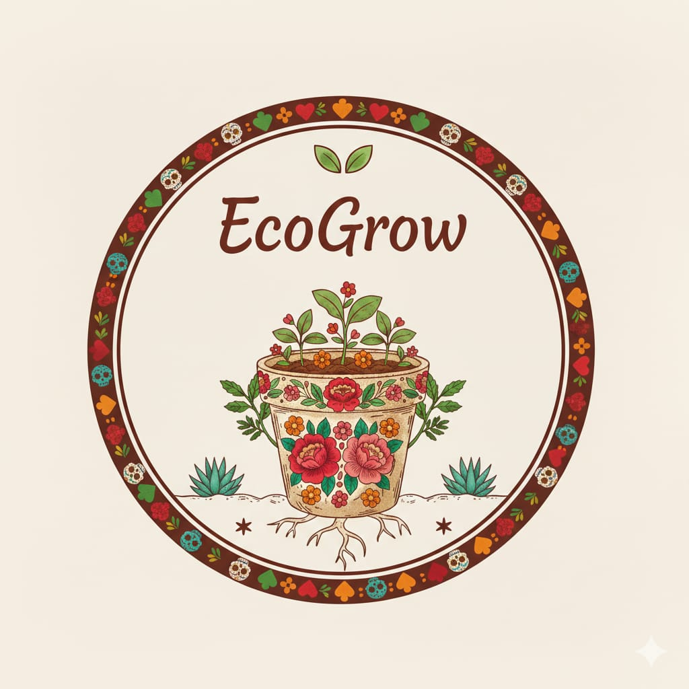
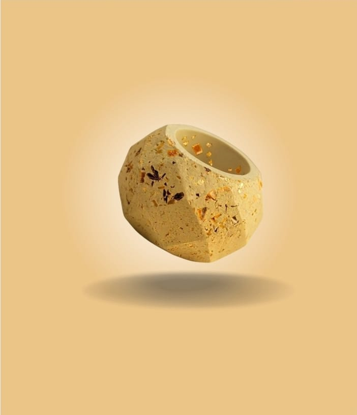
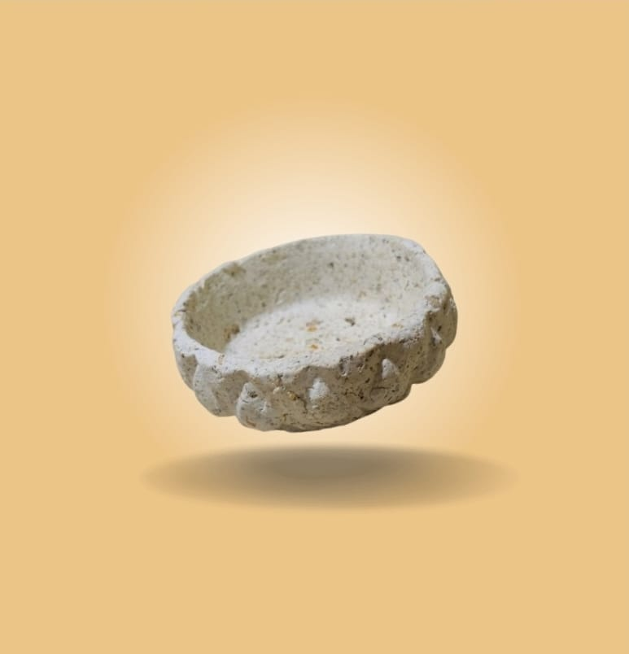
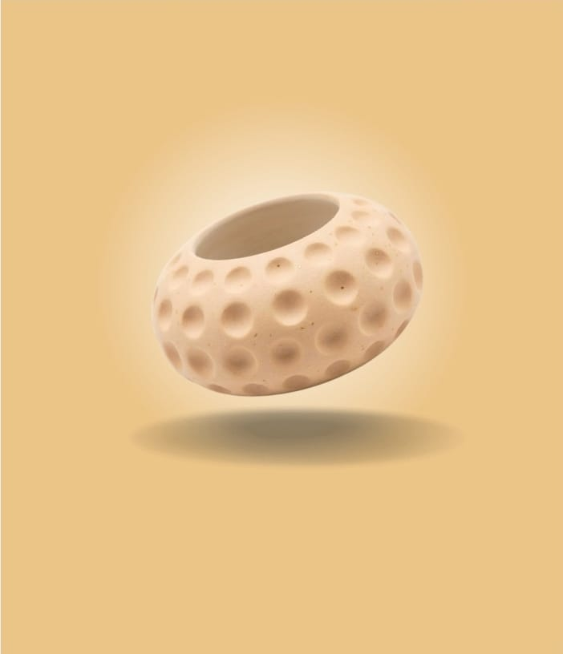

<!DOCTYPE html>
<html lang="es">
<head>
<meta charset="UTF-8">
<title>EcoGrow</title>

<link rel="stylesheet" href="https://cdnjs.cloudflare.com/ajax/libs/font-awesome/6.5.0/css/all.min.css">

</head>

<body>

<nav>

EcoGrow

<a href="#">Inicio</a>
<a href="#">Nosotros</a>
<a href="#">Macetas</a>
<a href="#">Galería</a>
<a href="#">Contacto</a>

<i class="fa-solid fa-magnifying-glass"></i>
<i class="fa-solid fa-cart-shopping"></i>

</nav>

<section class="hero">

BIENVENIDOS

<h1>EcoGrow</h1>

De la cascara a la Vida

</section>

<section class="productos">

<h2>Nuestras Macetas</h2>

<h3>Maceta EcoGrow</h3>

Hecha con cáscaras de frutas.

<h3>Maceta Natural</h3>

100% biodegradable.

<h3>Maceta Plant</h3>

Ideal para plantas pequeñas.

</section>

<section class="ventas">

<h2>Macetas en Venta</h2>

<h3>Maceta EcoGrow</h3>

Maceta biodegradable hecha con cáscaras de frutas.

$50

<button>Agregar al carrito</button>

<h3>Maceta Natural</h3>

Perfecta para plantas pequeñas.

$45

<button>Agregar al carrito</button>

<h3>Maceta Plant</h3>

100% ecológica y sustentable.

$55

<button>Agregar al carrito</button>

</section>

<section class="redes">

<h2>Síguenos</h2>

<a href="https://www.instagram.com/ecogrow.mx?igsh=MXBicnRhcmhvZTFwbA==" target="_blank">
<i class="fa-brands fa-instagram"></i>
</a>

<a href="#">
<i class="fa-brands fa-facebook"></i>
</a>

</section>

<footer>

© 2026 EcoGrow | Cuidando el planeta

</footer>

</body>
</html>
